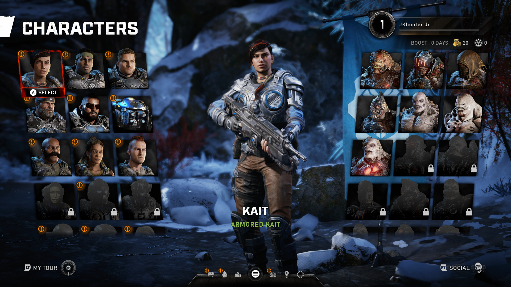
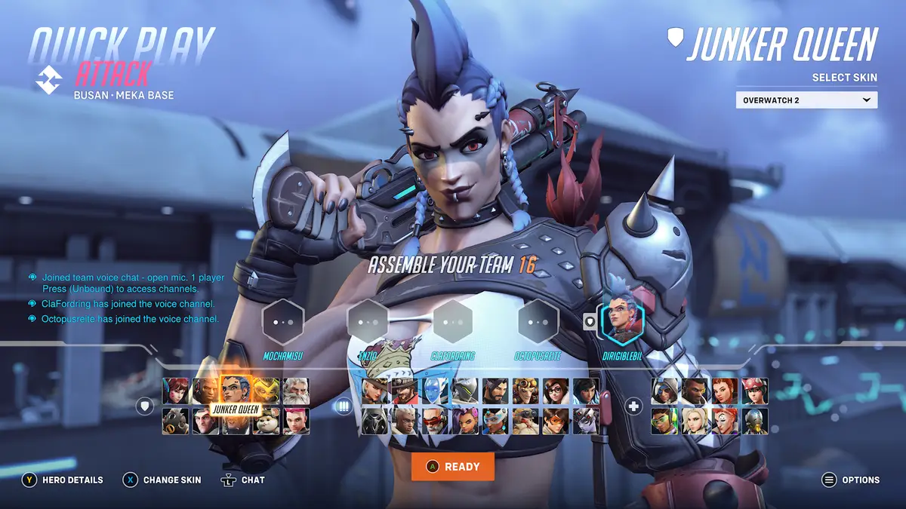

# Hero Select Screen

> A character select screen inspired by the hero selection in Overwatch 2. Built in Unreal Engine 5.2, UMG, and Common UI.

 

## Playable build

TODO.

 

## Motivation

Games such as *Outriders*, *Fortnite: Save the World*, and the *Gears of War* series (all developed by [People Can Fly](https://en.wikipedia.org/wiki/People_Can_Fly)) feature first- and third- person shooting at the core of their gameplay.

As games within the shooter genre, they have similar UI and UX design requirements. Game UI Database provides [numerous screenshots](https://www.gameuidatabase.com/gameData.php?id=294) as reference.

One of those common UX flows is character selection. See the character select UI from *Gears 5*:

Or the hero select UI from *Overwatch 2*:

In both designs, the player's goal is to select their desired character before entering a multiplayer game mode.

I wanted to practice my UI engineering skills in Unreal, so I decided to create a **data-driven, hero selection screen** inspired by the designs above.

This project contains the full source code of such a screen, and you can read more about the technical details below.

 

## Features

* Customizable skins
* Data-driven character animations
* Ability to rotate the character
* Character medallions, with selected, hovered, and pending states
* Data-driven character tiles
* Ability to select a tile to load the appropriate character within gameplay
* Hero details

 

---

> Jason Tu · [jasont.co](https://jasont.co/)
